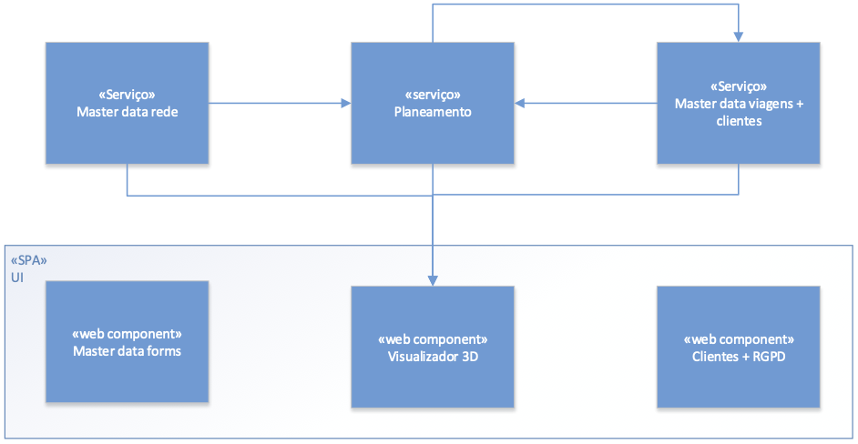

## Contents
- [Architecture Background](#architecture-background)
	- [Problem Background](#problem-background)
		- [System Overview](#system-overview)
		- [Context](#context)
		- [Driving Requirements](#driving-requirements)
			- [Functional requirements](#functional-requirements)
			- [Quality attributes](#quality-attributes)
				- [Funcionalidade](#funcionalidade)
				- [Usabilidade](#usabilidade)
				- [Confiabilidade (Reliability)](#confiabilidade-reliability)
				- [Desempenho (Performance)](#desempenho-performance)
				- [Suportabilidade](#suportabilidade)
				- [Design constraints](#design-constraints)
				- [Implementation constraints](#implementation-constraints)
				- [Interface constraints](#interface-constraints)
				- [Physical constraints](#physical-constraints)
	- [Solution Background](#solution-background)
		- [Architectural Approaches](#architectural-approaches)
		- [Analysis Results](#analysis-results)
		- [Mapping Requirements to Architecture](#mapping-requirements-to-architecture)

# Architecture Background
>Architecture Background provides information about the software architecture, by:
>- describing the background and rationale for the software architecture;
>- explaining the constraints and influences that led to the current architecture;
>- describing the major architectural approaches that have been utilized in the architecture.
  
## Problem Background
>The sub-parts of this section explain the constraints that provided the significant influence over the architecture.

### System Overview
> This section describes the general function and purpose for the system or subsystem whose architecture is described in this SAD.

### Context
> This section describes the goals and major contextual factors for the software architecture. The section includes a description of the role software architecture plays in the life cycle, the relationship to system engineering results and artifacts, and any other relevant factors.

Social network has been a part of our lifes for a long time and completely changed the way we communicate with each other and nowadays is almost mandatory for most organizations to be in some kind of social network. So as Graphs4Social decided to expand their business to the gaming area, they manage to focus their ideias in social network graphs.

This SAD serves as a basis for debate on the system to be built (to implement, test and deploy), and it is intended that it be aligned with the built system. In addition to the obvious in describing a software architecture, you should identify design alternatives and point of variation.

### Driving Requirements
> This section lists the functional requirements, quality attributes and design constraints. It may point to a separate requirements document.

#### Functional requirements

1. As a user I want to edit relationship strengh and connection strength.

2. As a user I want to edit my profile.

3. As a user I want to edit my mood state.

4. As a user I want to consult my friends network.

5. As a Not Registered User I should be able to regist myself in the system.

6. As a user I want to see which “objective users” (suggested by the system) would I like to have on my network.

7. As a user I want to search for users and request a connection.

8. As a user I want to ask for an introduction to a specific user.
	
9. As a user I want to be able to approve/disapprove introductions.

10. As a user I want to be able to accept/reject introductions.

11. As a user I want to be able to see the list of pending connections.

<inserir aqui o modelo de casos de uso/>

#### Quality attributes
Os atributos de qualidade são categorizados e sistematizados segundo o modelo [FURPS+](https://pt.wikipedia.org/wiki/FURPS).

##### Functionality
1. Each system can only access the data it concerns.
2. The integrity of the information accessed by the systems must be audited and verified.
3. In view of the need to know and the need to know, all information must be protected from unauthorized access. That is, the principle of minimizing access to what is essential for each user / application, creating tunnels for information transfer, evaluating data and application integrity, and encrypting / minimizing data.
4. Since the order management module is facing outwards, it is necessary to pay special attention to privacy and data protection in light of the RGPD. Thus, it is necessary that the system complies with the legislation in force and, in particular, provide legal information and inform the user when registering, as well as allowing and canceling his account in the cases and under the legally permitted conditions.

##### Usability
5. The SPA must allow access to all system modules: master data, planning and visualization, as well as RGPD.

6. Within the scope of the current project, the administration of users can be carried out directly in the database, without the need for a user management module.

##### Reliability
n/a

##### Performance
n/a

##### Supportability
7. Although it is not in the current scope of the project, the future extension to mobile applications must be taken into account in the solution architecture.

##### Design constraints
8. The system must be composed of a Single Page Application (SPA) web application that allows authorized users to access the different application modules, as well as a set of services that implement the business rules components necessary for the operation of the web application.

In general, the main features of each module are as follows:

- Master data – allows the management of information related to the network (nodes, routes), types of vehicles, types of crew, lines and trips.
- Planning – based on existing routes, plan crew changes at surrender points. Plan crew services based on vehicle services. Consumes the information managed in the master data module and publishes planning information to the visualization module.
- 3D Viewer – allows 2D and 3D visualization of the network, navigation through the scene and graphic consultation of travel information. Consumes the information managed in the master data module and in the module
- UI – user interface
- Customers + RGPD – information management of end users "customers" and their consent under the RGPD

9. Within the scope of the current project, the administration of users can be carried out directly in the database, without the need for a user management module.

10. Although not in the current scope of the project, the future extension to mobile applications must be taken into account in the solution architecture.

##### Implementation constraints
11. All modules must be part of the source code of the same SPA and be made available as a single artifact.

##### Interface constraints
12. The SPA must allow access to all system modules: master data, planning and visualization, as well as RGPD. (repeated because it concerns two categories)
13. The Planning module must consume network data through the master data API
14. The Planning module must consume travel data through the master data API
15. The Visualization module must consume network data through the master data API
16. The Visualization module must consume trip data through the master data "trips" API
17. The Visualization module must consume data from crew services through the planning API

[...]

##### Physical constraints
18. There are two servers in load balancing, where applications, services and databases are installed and which are in charge of storing the information.

19. There are also two failover servers that distribute addresses to all systems and are in charge of system and user authentication (DHCP, DNS (if applicable) and server authentication, and eventually a Kerberos server).
20. Some of the applications must be deployed *on premises* and others in IaaS and PaaS (*on cloud*). Cf. UC specific requirements per sprint.

## Solution Background
> The sub-parts of this section provides a description of why the architecture is the way it is, and a convincing argument that the architecture is the right one to satisfy the behavioral and quality attribute goals levied upon it.

### Architectural Approaches
> This section provides a rationale for major design decisions embodied by the software architecture. It describes any applied design approaches to software architecture, including the use of architectural styles or design patterns, when the scope of those approaches transcends any single architectural view. The section also provides a rationale for the selection of those approaches. It also describes any significant alternatives that were seriously considered and why they were ultimately rejected. The section describes any relevant COTS issues, including any associated trade studies.

Based on non-functional requirements and design constraints, the following approaches/patterns/styles will be adopted:

- Client-Server, because each of the "modules" MDR, MDV, Planning are server applications of other client applications (e.g. MDR is MDV and UI server, MDV is Planning and UI server, and Planning is UI server);
- Web Application, in which the frontend is performed by a SPA (Single Page Application), and the backend is performed by the MDR, MDV and Planning modules;
- SOA, because the servers (cf. above) must provide API, and particularly API to be used on the web, providing services for the respective clients. Levels 0, 1 and 2 of the [Richardson Maturity Model](https://martinfowler.com/articles/richardsonMaturityModel.html) applied to REST will be adopted;
- N-Tier, as the various applications must be deployed on different machines *on premises* and IaaS and PaaS (*on cloud*), according to non-functional requirements;
- Layered architecture, more specifically Onion Architecture, for academic reasons.

Other approaches/styles/standards, such as e.g. interconnection between applications based on messages-events were not considered not to violate the defined requirements and restrictions, but also for academic reasons.

### Analysis Results
> This section describes the results of any quantitative or qualitative analyses that have been performed that provide evidence that the software architecture is fit for purpose. If an Architecture Tradeoff Analysis Method evaluation has been performed, it is included in the analysis sections of its final report. This section refers to the results of any other relevant trade studies, quantitative modeling, or other analysis results.

There are currently no analysis or evaluation results. Qualitative studies about the adopted styles/patterns (namely Onion in MDR and MDV, but also Dependency Injection in the UI), allow empirically to advocate that the maintainability, evolution and testability of the software are high, while allowing the desired functionalities to be achieved.

### Mapping Requirements to Architecture
> This section describes the requirements (original or derived) addressed by the software architecture, with a short statement about where in the architecture each requirement is addressed.

TBD