## Contents
- [Views](#views)
	- [Introduction](#introduction)
	- [Level 1](#level-1)
		- [Logical View](#logical-view)
		- [Process View](#process-view)
            - [SSD UC3](#ssd-us3)
            - [SSD UC5](#ssd-us5)
            - [SSD UC6](#ssd-us6)
            - [SSD UC7](#ssd-us7)
            - [SSD UC6](#ssd-us8)
            - [SSD UC9](#ssd-us9)
            - [SSD UC10](#ssd-us10)
            - [SSD UC11](#ssd-us11)
            - [SSD UC12](#ssd-us12)
            - [SSD UC33](#ssd-us33)
            - [SSD UC6](#ssd-us35)
	- [Level 2](#level-2)
        - [Logical View](#logical-view-1)
        - [Implementation View](#implementation-view)
        - [Physical View](#physical-view)
        - - [Process View](#process-view-1)
			- [SD UC3](#ssd-us3)
			- [SD UC5](#ssd-us5)
			- [SD UC6](#ssd-us6)
			- [SD UC7](#ssd-us7)
			- [SD UC6](#ssd-us8)
			- [SD UC9](#ssd-us9)
			- [SD UC10](#ssd-us10)
			- [SD UC11](#ssd-us11)
			- [SD UC12](#ssd-us12)
			- [SD UC33](#ssd-us33)
			- [SD UC6](#ssd-us35)
	- [Level 3 (MDR)](#level-3-mdr)
        - [Logical View](#logical-view-2)
        - [Implementation View](#implementation-view-1)
        - [Physical View](#physical-view-1)
        - - [Process View](#process-view-2)
			- [SSD UC3](#ssd-us3)
			- [SSD UC5](#ssd-us5)
			- [SSD UC6](#ssd-us6)
			- [SSD UC7](#ssd-us7)
			- [SSD UC6](#ssd-us8)
			- [SSD UC9](#ssd-us9)
			- [SSD UC10](#ssd-us10)
			- [SSD UC11](#ssd-us11)
			- [SSD UC12](#ssd-us12)
			- [SSD UC33](#ssd-us33)
			- [SSD UC6](#ssd-us35)
	- [Level 3 (UI)](#level-3-ui)
		- [Logical View](#logical-view-3)
		- [Process View](#process-view-3)
		- [Implementation View](#implementation-view-2)
		- [Physical View](#physical-view-2)
	- [Level 3 (MDV)](#level-3-mdv)
		- [Logical View](#logical-view-4)
		- [Process View](#process-view-4)
		- [Implementation View](#implementation-view-3)
		- [Physical View](#physical-view-3)
	- [Level 3 (Planning)](#level-3-planning)
		- [Logical View](#logical-view-5)
		- [Process View](#process-view-5)
		- [Implementation View](#implementation-view-4)
		- [Physical View](#physical-view-4)

# Views 

## Introduction
A combination of two architectural representation models will be adopted: C4 and 4+1.

The 4+1 View Model [[Krutchen-1995]](References.md#Kruchten-1995) proposes the description of the system through complementary views, thus allowing to analyze separately the requirements of the various software stakeholders, such as users, administrators of systems, project managers, architects and programmers. Views are thus defined as follows:

- Logical view: concerning the aspects of the software aiming to respond to business challenges;
- Process view: related to the flow of processes or interactions in the system;
- Development view: related to the organization of the software in your development environment;
- Physical view: related to the mapping of the various software components in hardware, i.e. where the software runs;
- View of scenarios: relating to the association of business processes with actors capable of triggering them.

The C4 Model [[Brown-2020]](References.md#Brown-2020)[[C4-2020]](References.md#C4-2020) defends the description of the software through four levels of abstraction: system, container , component and code. Each level adopts a finer granularity than the level before it, thus giving access to more detail of a smaller part of the system. These levels can be likened to maps, eg system view corresponds to the globe, container view corresponds to the map of each continent, component view to the map of each country and code view to the map of roads and districts of each City.
Different levels let you tell different stories to different audiences.

The levels are defined as follows:
- Level 1: Description (framework) of the system as a whole;
- Level 2: Description of system containers;
- Level 3: Description of container components;
- Level 4: Description of code or smaller parts of components (and as such will not be covered in this DAS/SAD).

It can be said that these two models expand along different axes, with Model C4 presenting the system with different levels of detail and the 4+1 View Model presenting the system from different perspectives. Combining the two models makes it possible to represent the system from different perspectives, each with different levels of detail.

To visually model/represent both what was implemented and the ideas and alternatives considered, the Unified Modeling Language (UML) [[UML-2020]](References.md#UML-2020) [[UMLdiagrams-2020] ](References.md#UMLDiagrams-2020).

## Level 1
### Logical View

### Process View
#### SSD UC3
n/d

#### SSD UC5
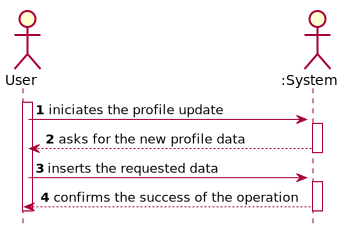

#### SSD UC6
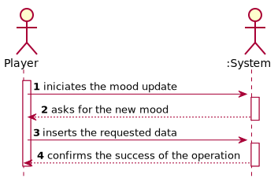

#### SSD UC7
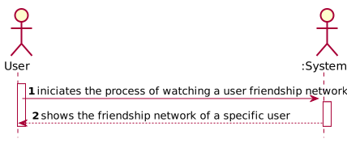

#### SSD UC8
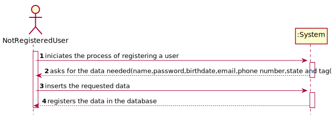

#### SSD UC9
n/d

#### SSD UC10
n/d

#### SSD UC11
n/d

#### SSD UC12
n/d

#### SSD UC33
n/d

#### SSD UC35
n/d

## Level 2
### Logical View

### Physical View

### Implementation view

### Process View

#### SD UC3
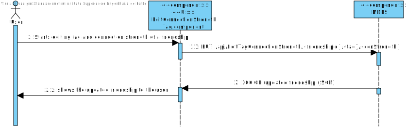

#### SD UC5
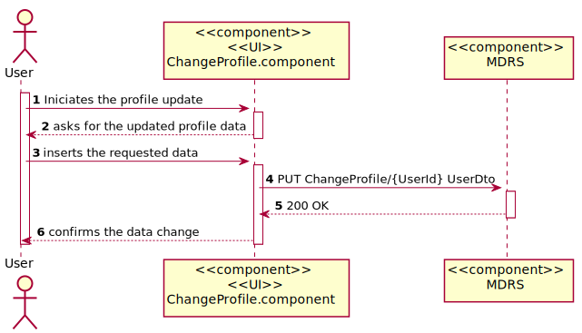

#### SD UC6
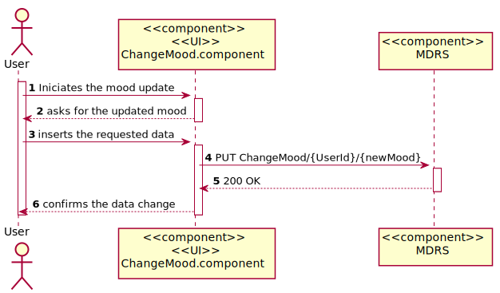

#### SD UC7
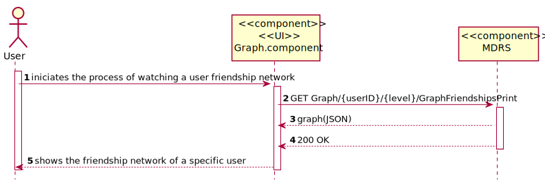

#### SD UC8
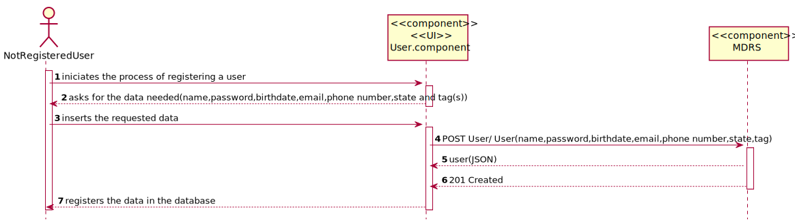

#### SD UC9
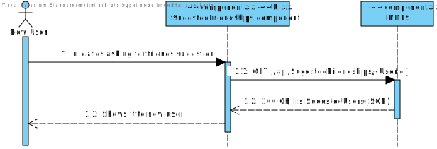

#### SD UC10
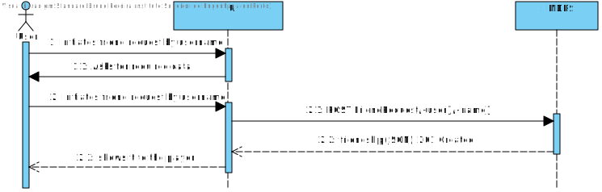

#### SD UC11
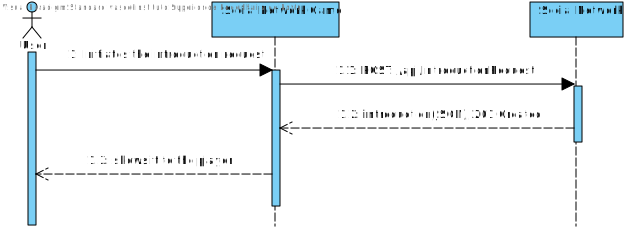

#### SD UC12
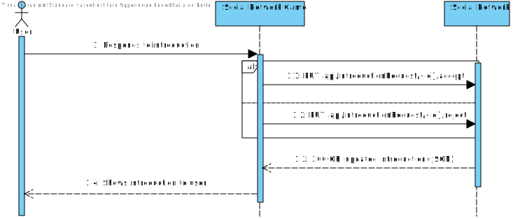

#### SD UC33
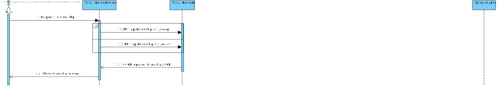

#### SD UC35
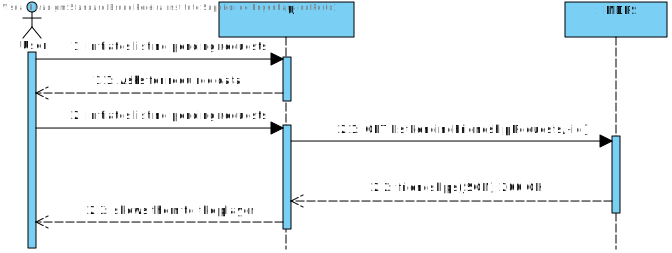

## Level 3 (Social Network Game)
### Logical View
## Alternative based on an overlapping layered architecture:

##Alternative based on a concentric layer architecture (Onion):

The Onion alternative will be adopted.

### Implementation View

For now, there is no need to be represented.

### Physical View

For now, there is no need to be represented.

### Process View

#### SD UC3

#### SD UC5

#### SD UC6

#### SD UC7

#### SD UC8

#### SD UC9

#### SD UC10

#### SD UC11

#### SD UC12

#### SD UC33

#### SD UC35

## Level 3 (UI)
### Logical View
TBD

### Process View
TBD

### Implementation View
TBD

### Physical View
TBD

## Level 3 (MDV)
### Logical View
TBD

### Process View
TBD

### Implementation View
TBD

### Physical View
TBD

## Level 3 (Planning)
### Logical View
TBD

### Process View
TBD

### Implementation View
TBD

### Physical View
TBD